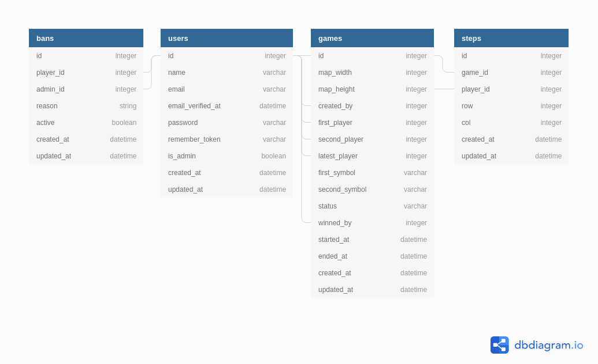

# Adatbázis terv

Ez a fájl részletezi az alkalmazáshoz készített adatbázis tervet, továbbá kitér az adatmodellben szükséges főbb metódusokra, és logikára is.

## Táblák szerkezete

User
- id (id)
- email (string)
- name (string)
- nickname (string)
- nickname_color
- avatar_path (string)
- score (int)
- is_admin (bool)
- banned (bool)
- created_at (datetime)
- updated_at (datetime)

Game
- id (id)
- map_width (int, default 12)
- map_height (int, default 12)
- created_by (User)
- first_player (User, nullable)
- second_player (User, nullable)
- latest_player (User, nullable)
- first_symbol (char, O/X)
- second_symbol (char, O/X, nem a first_symbol)
- status (enum: WAITING, STARTED, ABANDONED, ENDED, default WAITING)
- winned_by (User, nullable)
- started_at (datetime)
- ended_at (datetime)
- created_at (datetime)
- updated_at (datetime)

Step
- id (id)
- game_id (Game)
- player_id (User)
- row (int)
- col (int)
- created_at (datetime)
- updated_at (datetime)

Ban
- id (id)
- user_id (User)
- admin_id (User)
- reason (string)
- active (bool)
- created_at (datetime)
- updated_at (datetime)

## Metódusok megtervezése

Ahhoz, hogy az alkalmazás hatékonyan tudjon működni, a fenti adatbázis terven kívül a Laravel modell rétegében meg kell valósítani különböző metódusokat is. Ezek megvalósítják a játék főbb logikáját, illetve megkönnyítik a modellekkel végzett munkát a fejlesztés további szakaszaiban.

### A játék logikája

A metódusok megtervezéséhez fontos felvázolni az amőba játék logikáját, ami a következő a mi esetünkben:
- Képzeljünk el egy mátrixot, ez a játéktér (esetünkben 12x12-es).
- A játékosokhoz (ahová léptek) számokat rendelünk:
    - az első játékoshoz 1-et,
    - a második játékoshoz 6-ot.
- Azt a mezőt pedig, ahová még nem léptek, 0-val jelöljük.
- Érdemes minden lépés után vizsgálni, hogy történt-e nyerés, vagy alakult-e ki döntetlen(re vezető) helyzet.
- Tudjuk, hogy egy játékos melyik sorban, melyik oszlopra lépett (x,y), ezért az adott pozícióból meg tudjuk mondani, hogy nyert-e: ötösével megvizsgáljuk az adott sort, oszlopot, \/ átlót, és ha az egyik ilyen szelet elemeinek az összege 5 vagy 30, akkor nyert az 1. vagy a 2. játékos.
- Döntetlen esetén megnézünk minden sort, oszlopot és átlót, szintén ötösével. Ha egy ilyen szelet (részhalmaz) összege kisebb vagy egyenlő, mint 5; vagy 6-tal maradék nélkül osztható, akkor a játék folytatható.

### Szükséges metódusok

A fent ismeretett logika szerint a játékhoz szükséges metódusok nagyjából az alábbiak lesznek:

- Game
    - **isValidPosition($row, $col)**
        - Megmondja, hogy egy pozíció koordinátái a pályán belül vannak-e.
    - **isPositionAvailable**
        - Megmondja, hogy egy adott pozíció szabad-e még, tehát azt, hogy lépett-e oda. valaki
    - **updateLatestPlayer($row, $col)**
        - Módosítja a legutóbb lépett játékost.
    - **createZeroMatrix($rows, $cols) (static)**
        - Készít egy mátrixot, aminek minden eleme nulla.
    - **getMapAsMatrix()**
        - Lekéri a játékhoz tartozó lépéseket, és oly módon képezi le a játékteret egy mátrixba, hogy az a mező, ahova...
            - még nem léptek, 0 értékű legyen;
            - ahová az első játékos lépett, az 1 legyen;
            - ahová pedig a második játékos lépett, az 6 legyen.
    - **getLeftToRightDiagonal($matrix, $row, $col) (static)**
        - Lekéri azt a balról jobbra haladó átlót (pongyolán "főátlót"), amelyiknek az adott koordináta is a része
    - **getRightToLeftDiagonal($matrix, $row, $col) (static)**
        - Lekéri azt a jobbról balra haladó átlót (pongyolán "mellékátlót"), amelyiknek az adott koordináta is a része
    - **checkPartiallyWin($part) (static)**
        - Megadja, hogy egy sort, oszlopot vagy átlót megnyert-e egy játékos.
    - **checkWin($matrix, $row, $col) (static)**
        - Minden lépés után megnézzük, hogy a játékot megnyerték-e. Ezzel a módszerrel visszafelé bebiztosítjuk magunkat, hiszen folyamatosan vizsgáljuk a nyerést, vagyis nem kell mindig a teljes mátrixot vizsgálni.
        - Ez a metódus pontosan egy adott pozícióból (ahová a legutóbb léptek) mondja meg, hogy történt-e nyerés.
    - **checkPartiallyTie($part) (static)**
        - Megadja, hogy egy sortban, oszlopban vagy átlóban alakulhat-e még ki nyerés.
    - **checkTie($matrix) (static)**
        - Minden lépés után megnézzük, hogy a játékot még érdemes-e folytatni, vagy már döntetlen helyzet alakult ki, és nem lehet a játékot olyan módon befejezni, hogy azt biztosan megnyerhesse az egyik játékos.
    - **join(User $player)**
        - Játékos csatlakoztatása
    - **isPlayerInThisGame(User $player)**
        - Egy játékos benne van-e a játékban
    - **step(User $player, $row, $col)**
        - Lépés megtétele egy adott pozícióra.
        - Vizsgálni kell a kizáró okokat (pl. ha a játék nincs elindítva, vagy a pozíció érvénytelen, foglalt, stb.)
        - A lépés regisztrálása után minden esetben ellenőrizni kell a nyerést és a döntetlen helyzetet is.
    - **start()**
        - Játék elindítása.
    - **abandon()**
        - Játék megszakítása (ez nem ugyanaz, mint a sima befejezés, erre van az 'ABANDONED' status).
    - **end()**
        - Játék befejezése.

- User
    - **games()**
        - A felhasználóhoz tartozó játékok lekérése.
    - **winnedGames()**
        - A felhasználóhoz tartozó megnyert játékok lekérése.
    - **currentGame()**
        - A felhasználóhoz tartozó aktuális játék lekérése (ha van ilyen, amúgy pl. adjon null-t).
    - **isInGame()**
        - Az előző metódusra épül, megnézi, hogy a felhasználóhoz tartozik-e aktuális játék, amiben benne van.
    - **createGame()**
        - Játék létrehozása, amelynek a creator-ja ez a felhasználó lesz.
    - **joinGame(Game $game)**
        - Csatlakozás egy már meglévő játékhoz, amennyiben az lehetséges.
    - **leaveCurrentGame()**
        - Aktuális játék elhagyása, amennyiben van olyan.
    - **step($row, $col)**
        - Lépés megtétele az aktuális játékban, amennyiben van olyan.

A fejlesztés során valószínűleg szükséges lesz további metódusok bevezetése is.
